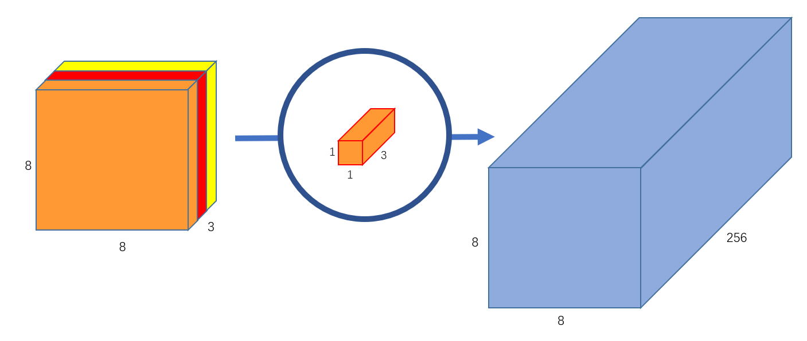
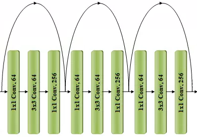

# Conv-vs-Depthwise-Sep-Conv

[Tensorflow lib ResNet source with weights](https://github.com/tensorflow/tensorflow/blob/5dcfc51118817f27fad5246812d83e5dccdc5f72/tensorflow/python/keras/applications/resnet.py)

Введение
========

Conv2D - основной наиболее часто использующийся слой в нейронных сетях.
Его главный минус большое число параметров. Как альтернативу ему во
всяких мобильных реализациях используют [Depthwise Separable
Convolutions](https://medium.com/@zurister/depth-wise-convolution-and-depth-wise-separable-convolution-37346565d4ec) , обладающие гораздо меньшим числом параметров и высокой
скоростью работы (до 9 раз быстрее). При этом
размерность выходного слоя остаётся такой же. Это достигается за счёт
замены Conv2D (3x3) на два слоя DepthwiseConv2D (3x3) + Conv2D (1x1)
иногда с добавлением\
BatchNormailzation и ReLU слоёв между ними.

А что если после обучения нейронной сети заменить Conv2D на\
DepthwiseConv2D (3x3) + Conv2D (1x1) при этом подобрать веса таким
образом чтобы разница на выходе была минимальна. Затем после такой
замены немного доучить нейронную сеть чтобы она скорректировала веса и
повысила точность. Это позволит сократить размер нейронной сети и
увеличить скорость её работы при сохранении (или незначительном
уменьшении) точности.

Постановка задачи
=================

Провести эксперимент по замене слоев Conv2D(3x3) на сомбинацию\
DepthwiseConv2D (3x3) + Conv2D (1x1) в нейронной сети. Минимизировать
разницу между замененными слоями так, чтобы точность итоговой модели не
изменилась или изменилась на небольшое значние. Сравнить количество
параметров и объем весов исходной и обновленной модели. Провести
тестирование моделей и анализ результатов.

Сравнение Conv2D и Depthwise Separable Conv
===========================================

 [Сверточные нейронные сети](https://medium.com/nuances-of-programming/глубокие-свёрточные-нейросети-руководство-для-начинающих-99fc83022bab)
 основаны на операции свертки. Свертка -
процесс перемножения входных данных с ядром/фильтром и последующим
сложением полученных данных.

Особенность такого слоя в том, что матрица свертки итеративно проходит
по всем размерностям входного изображения. Для выполнения этой операции
требуется N матриц размером (D,D) и размерностью M с количеством
параметров: N* M* D^2.

Существует облегченный аналог сверточного слоя - Deepwise Separable
Convolution. Такой слой работает в 2 эпата. Первый - по каждой
размерности один раз проходит матрица свертки

и затем одновременно по всем размерностям проходит обычная матрица свертки
размером (1,1)

 

Количество параметров для такого слоя: M*(D^2+N).
Если поделить количество параметров для DWconv и Conv2D, то получится
выражение: 1/N + 1/D^2. Возьмем для примера эти два слоя
с ядром (3,3) и количество выходных фильтров 256. Для этого случая
поличим, что количество параметров в обычном Conv2D слое в **8,7 раз**
больше, чем в облегченном DWconv.

Из-за понижения количества параметров и понижается требуемая
вычислительная мощность для оубчения модели, но при этом не всегда ясно
сможет ли слой DWconv полноценно заменить Conv2D. Снижение количества
параметров может вызвать проблемы в процессе генерализации выборки.

Проведение эксперимента
=======================

В качестве рабочего фреймворка был выбран TensorFlow. Требуемые для
эксперимента функции реализованы в этом фреймворке в достаточном удобном
и простом виде, по сравнению с PyTorch.

Для выполнения работы требуется заменить обычные сверточные слои на слой
Depthwise Separable Convolutions (DWConv). При замене может возникнуть
сильная разница между новыми и старыми выходными значениями. Рассмотрим
несколько вариантов решения проблемы

**Путь 1. Минимизация разницы между слоями на основе принципов работы
алгоритмов**. Слои Conv2D и DWConv имеет похожий принцип работы. В обоих
случаях используется матрица свертки, которая итеративно перемещается по
всем размерностям изображения. Возможно, добавление новых шагов в
алгоритме DWConv сможет минимизировать снизить разницу, но неизвестно на
сколько. Трудность в том, что все изменения алгоритмов DWConv будут
вести к 2 результатам: либо из DWConv получится обычный Conv2D, либо
количество новых параметров будет сопоставимым с Conv2D. Такой путь не
походит

**Путь 2. Минимизация разницы при помощи scipy.minimize**. Использование
различных методов оптимизации (метод Ньютона, градиентный спуск, адам)
работают на основе значений функции ошибки, которая высчитывается после
каждой итерации. Такие методы имеют 1 недостаток - не все методы
оптимизации можно применять для алгоритмов, работающих итеративно и не
имеющих четкого прогноза входных и выходых данных. Такой вариант тоже не
поддходит

**Путь 3. Минимизация разницы при помощи дообучения моделей сверточных
блоков**. Дообучение блоков с DWConv вместе с обученными обычными Conv2D
блоками может показать хороший результат. В современных нейронных сетях
достаточно много обычных Conv2D слоев, которые могут эффективно помочь
\"новым\" слоям подобрать нужные значения. Выберем этот способ.

Модульная архитектура
---------------------

В качестве базовой архитектуры была выбрана модель ResNet50, состоящая
из 16 сверточных \"остаточных\" (residual) блоков. Каждый блок
базируется на 3 сверточных слоях с разным размером ядра: 1х1, 3х3 и 1х1
соответсвенно.

Модель состоит из 4 стаков блоков.

-   3 блока по 64 базовых фильтров

-   4 блока по 128 базовых фильтров

-   6 блока по 256 базовых фильтров

-   3 блока по 512 базовых фильтров

Для выполнения эксперимента добавим в каждый сверточный блок возможность
переключения слоя Conv2D(3x3) на DepthwiseConv2D (3x3) + Conv2D (1x1),
где количетво фильтров у 1х1 слоя равно базовому количеству фильтров в
слое.

В итоге модель ResNet50 представляется в виде 18 моделей: 1 входная, 1
выходная и 16 промежуточных.

Обучение и результаты
---------------------

В качестве задача была выбрана классификация изображений. Датасет - 50
тысяч снимков 10 классов изображений.

Обучение проходило в несколько этапов. Оптимизатор -
RMSprop(centered=True, learning\_rate=0.00001), метрика ошики -
categorical\_crossentropy.

**Первый этап**. Обучение обычных сверточных блоков resnet50 для
классификации изображений. Сохранение весов.

**Второй этап**. Последовательная замена блоков Conv2D на DWConv и
дообучение модели. Если точность на тестовой выборке составляент меньше
70 %, то обычный сверточный блок возвращается, а если выше, то DWConv
блок остается. Так постепенно проходим по всей архитектуре.

**Третий этап**. Когда дошли до конца, то начинаем замещать оставшиеся
блоки в направлении снизу-\>вверх.

|     block     |    test acc     | DWConv replace  |
|:-------------:|:---------------:|:-----:|
| block_conv2_1 |  0,80     |   \+ |
| block_conv2_2 |  0,81     |   \+ |
| block_conv2_3 |  0,81     |   \+ |
| block_conv3_1 |  **0,41** |   **-** |
| block_conv3_2 |  0,75     |   \+ |
| block_conv3_3 |  **0,58** |   **-** |
| block_conv3_4 |  **0,68** |   **-** |
| block_conv4_1 |  **0,46** |   **-** |
| block_conv4_2 |  0,76     |   \+ |
| block_conv4_3 |  **0,64** |   **-** |
| block_conv4_4 |  0,76     |   \+ |
| block_conv4_5 |  0,78     |   \+ |
| block_conv4_6 |  0,76     |   \+ |
| block_conv5_1 |  **0,33** |  **-** |
| block_conv5_2 |  0,78     |   \+ |
| block_conv5_3 |  0,79     |   \+ |

Как видно по таблице удалось заменить 10 блоков из 16, т.е. 63%
модели ResNet50 без значительных потерь по точности. Некоторые блоки не
удалось заменить, так как они играли важную роль в пайплайне обучения.

Уменьшение параметров оказывает сильное влияние на процесс обучения в
виде блокирования процесса генерализации выборки. Иными словами, модель
не может подобрать правильные веса. Зачастую в такой ситуации модель
показывала очень высокий уровень переобучения (например, точность во
время обучения 0.9, а во время тестирования 0.4).

Выводы
======

Замена Conv2D (3x3) на два слоя DepthwiseConv2D (3x3) + Conv2D (1x1)
может снизить количество используемых параметров без серьезного падения
точности модели. В проведенном исследовании получилось уменьшить
количество используемых параметров сети на **25%**, объем памяти весов
на **25%** и повысить скорость работы на **1.5%**.

|модель      |    train acc.   | test acc. | time, s  | params.,million | weight, MiB  |
|:----------:|:---------------:|:---------:|:--------:|:---------------:|:------------:|
|classical resnet50 |      0,86       |   0,81    |   19,9   |      26,22      |    100,36    |
|DWConv resnet50    |      0,85       |   0,79    |   19,6   |      19,73      |    75,56  |    
|difference         |      1,16%      |   2,47%   |  1,51%   |   **24,75%**    |  **24,71%**  |

Ссылки
======

[Веса](https://drive.google.com/drive/folders/1leh46fimZCi4X_2ExAJv6W2mfZZw-fcT?usp=sharing)

[A Comprehensive Introduction to Different Types of Convolutions in Deep
Learning](https://towardsdatascience.com/a-comprehensive-introduction-to-different-types-of-convolutions-in-deep-learning-669281e58215)

[ResNet50 Tensorflow
](https://github.com/tensorflow/tensorflow/blob/5dcfc51118817f27fad5246812d83e5dccdc5f72/tensorflow/python/keras/applications/resnet.py)

[ResNet weights](https://github.com/tensorflow/models/blob/master/official/vision/beta/MODEL_GARDEN.md)

[ResNet source](https://github.com/tensorflow/models/blob/master/official/vision/image_classification/resnet/resnet_model.py)
