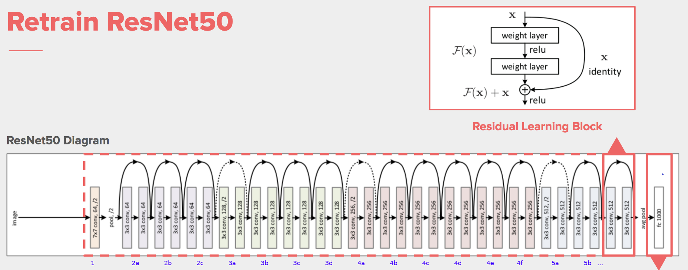

# Conv-vs-Depthwise-Sep-Conv

Замена Conv2D на Depthwise Separable Convolutions в нейронных сетях

Conv2D - основной наиболее часто использующийся слой в нейронных сетях. Его главный минус большое число параметров. Как
альтернативу ему во всяких мобильных реализациях используют Depthwise Separable Convolutions, обладающие гораздо меньшим
числом параметров и высокой скоростью работы (до 9 раз быстрее) [1, 2]. При этом размерность выходного слоя остаётся
такой же. Это достигается за счёт замены Conv2D (3x3) на два слоя DepthwiseConv2D (3x3) + Conv2D (1x1) иногда с
добавлением BatchNormailzation и ReLU слоёв между ними [3].

А что если после обучения нейронной сети заменить Conv2D на DepthwiseConv2D (3x3) + Conv2D (1x1) при этом подобрать веса
таким образом чтобы разница на выходе была минимальна. Затем после такой замены немного доучить нейронную сеть чтобы она
скорректировала веса и повысила точность. Это позволит сократить размер нейронной сети и увеличить скорость её работы
при сохранении (или незначительном уменьшении) точности.

[Tensorflow lib ResNet source with weights](https://github.com/tensorflow/tensorflow/blob/5dcfc51118817f27fad5246812d83e5dccdc5f72/tensorflow/python/keras/applications/resnet.py)

Other links
----------

[ResNet weights](https://github.com/tensorflow/models/blob/master/official/vision/beta/MODEL_GARDEN.md)

[ResNet source](https://github.com/tensorflow/models/blob/master/official/vision/image_classification/resnet/resnet_model.py)
